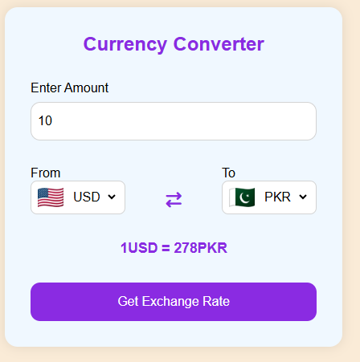
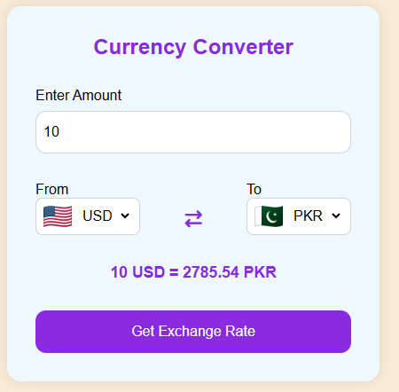

# Currency Converter Web App

A responsive Currency Converter Web App built with HTML, CSS, and JavaScript using a real-time Exchange Rate API.

## 📸 Preview


## 🔗 Live Demo
[🎮 Play Live Game](https://kg-se.github.io/currency-converter/)

## 🚀 Features
- Real-time currency conversion
- Dynamic country flags
- Responsive design
- Exchange rate API integration
- Async/Await & Fetch API
- User-friendly interface
- Default currency selection
- Input validation

## 🛠️ Technologies Used
- HTML5
- CSS3
- JavaScript (ES6)
- Exchange Rate API
- Flag CDN API

## 📸 Screenshots

### App UI


### Real-Time Currency Converter



## What I Learned

Through this project, I improved my understanding of:

- API fetching with Fetch API
- Async/Await in JavaScript
- DOM Manipulation
- Event Handling
- Dynamic UI updates
- Responsive Web Design

## 📁 Project Structure
```bash
index.html
style.css
code.js
script.js
screenshots/
```

## 👨‍💻 Author
**Kashan Ghori**  
🔗 https://github.com/KG-SE

---
